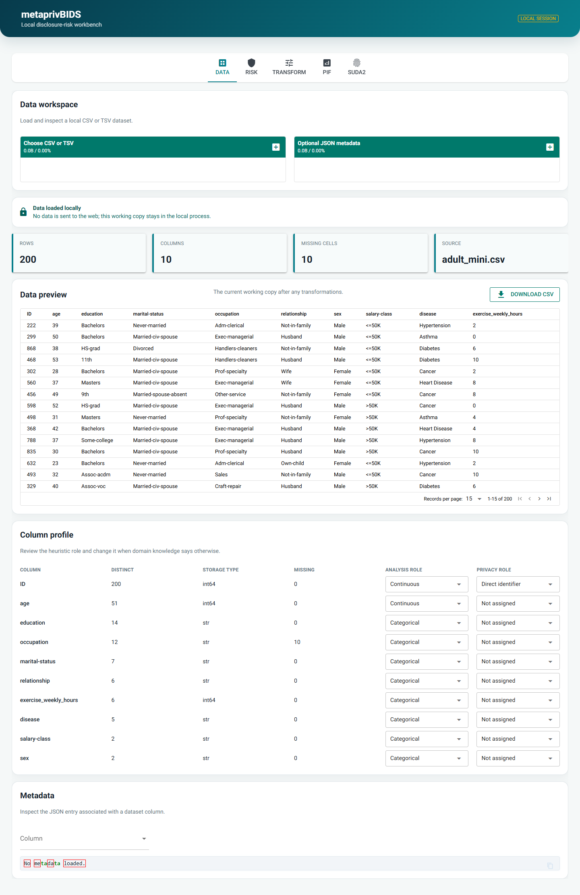
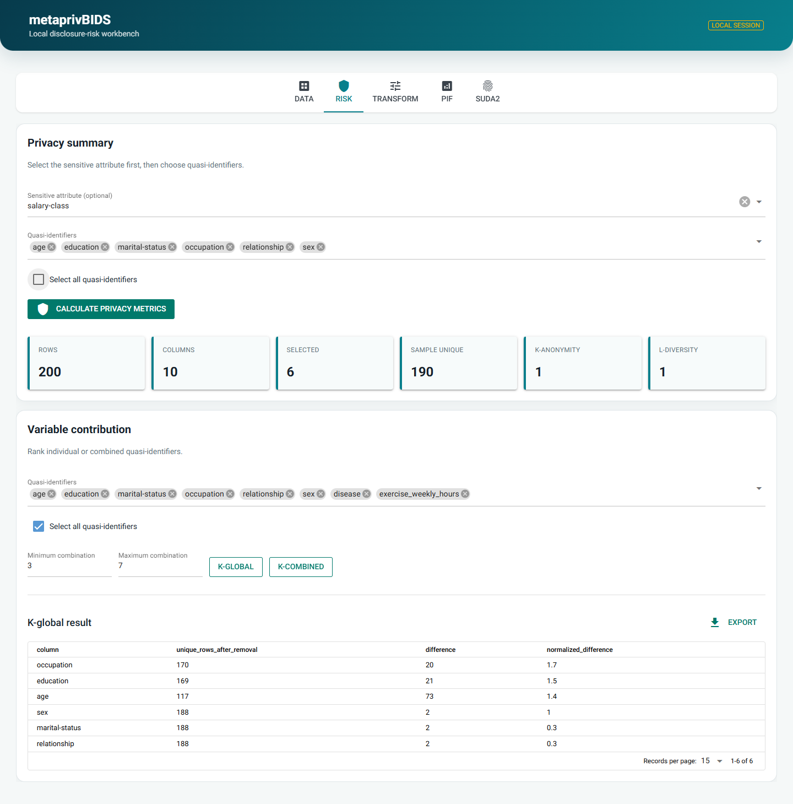
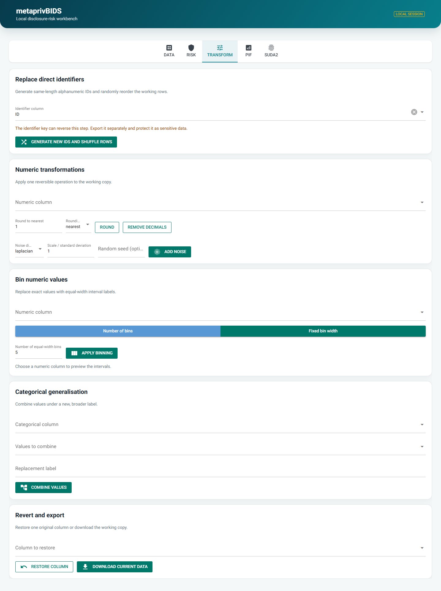
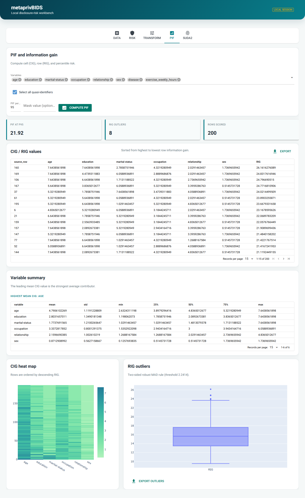
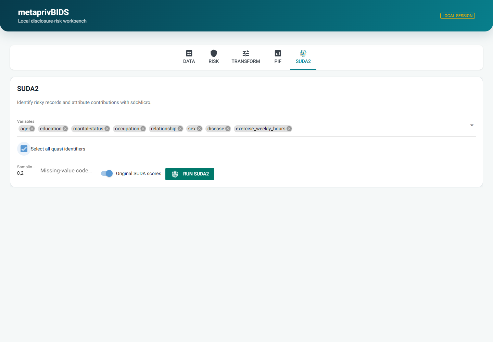

.. _examples_section:

Browser workflow
================

This walkthrough uses ``Use_Case_Data/adult_mini.csv``. Start the local
application from the repository root:

.. code-block:: console

   conda run --name metaprivbids metaprivBIDS-gui

The browser is only a local interface to the same functions exposed by the
command line and Python API. The server binds to ``127.0.0.1`` and the working
dataset remains in the local process.

1. Load and describe the data
-----------------------------

Open **Data** and choose a CSV or TSV file. An optional JSON sidecar can be
loaded separately. After loading, the page confirms that the data is local,
shows basic dimensions, and provides a paginated preview.

Review the column profile before calculating risk:

* **Analysis role** controls whether a variable is offered to numeric or
  categorical transformations. The initial role is heuristic and can be
  corrected manually.
* **Privacy role** designates a direct identifier such as ``ID``. A direct
  identifier is excluded from quasi-identifier and ordinary transformation
  selectors.
* **Storage type**, distinct values, and missing values describe the loaded
  representation; they do not replace domain knowledge.

2. Calculate the privacy summary
--------------------------------

Open **Risk**. Select the sensitive attribute first, if there is one, and then
choose the quasi-identifiers. **Select all quasi-identifiers** selects every
eligible variable except the sensitive attribute and designated direct
identifier. Individual selections remain editable.

**Calculate privacy metrics** reports sample-unique rows, k-anonymity, and
l-diversity. L-diversity is only calculated when a sensitive attribute is
selected.

The **Variable contribution** section has its own selection and select-all
control. K-global ranks the effect of removing one variable. K-combined
evaluates variable combinations between the requested minimum and maximum
sizes. Both tables can be exported.

3. Transform the working copy
-----------------------------

Open **Transform** to mitigate risk. Every operation creates a new working
copy; the shared core functions do not mutate their input dataframe.

Available transformations are:

* replace a complete, unique direct-identifier column with unique,
  same-length alphanumeric values and randomly shuffle the rows;
* round a numeric variable to units, tens, hundreds, and so on, using nearest,
  upward, or downward rounding;
* remove decimals by truncating toward zero;
* add Laplacian or Gaussian noise with a scale and optional random seed;
* bin numeric values into a chosen number of equal-width intervals or fixed-
  width intervals; and
* combine categorical values under a broader replacement label.

When replacement IDs are generated, download the identifier key separately.
It can reverse the replacement and must be protected as sensitive data. Use
**Restore column** to discard transformations on one column, or **Download
current data** to export the complete working copy.

4. Inspect PIF and information gain
-----------------------------------

Open **PIF**, choose variables individually or with **Select all
quasi-identifiers**, set the percentile, and optionally identify a mask or
missing value. **Compute PIF** calculates cell information gain (CIG), row
information gain (RIG), and the PIF at the requested percentile.

The results include the complete CIG/RIG table, a per-variable summary, a heat
map, and a robust MAD outlier plot. Hovering over an outlier displays its
source row rather than repeating the RIG value. Tables and outliers can be
exported.

5. Run SUDA2
------------

Open **SUDA2** and select variables individually or with **Select all
quasi-identifiers**. Set the population sampling fraction, an optional
missing-value code, and the score convention, then select **Run SUDA2**.

SUDA2 runs locally through R, ``rpy2``, and ``sdcMicro``. The result contains
record scores, percentage contribution by cell, variable contributions, and
attribute-level contributions. The disclosure-score outlier plot identifies
the source row on hover. Each result table and the outlier table can be
exported.

Reproduce the screenshots
-------------------------

The screenshots are generated from the current application and sample data;
they do not need to be captured manually. Contributors can refresh them with:

.. code-block:: console

   conda run --name metaprivbids uv pip install -e ".[screenshots]"
   conda run --name metaprivbids python scripts/capture_docs_screenshots.py

On Linux or macOS, install Playwright's Chromium browser once before running
the capture command:

.. code-block:: console

   conda run --name metaprivbids python -m playwright install chromium

The script starts a temporary loopback-only application, loads
``adult_mini.csv``, captures the five tabs into ``docs/_static``, and shuts the
temporary server down.
